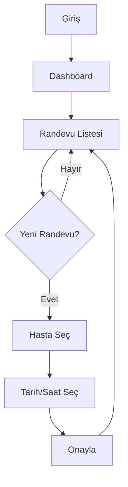

# UI/UX Designer Skill

## Rol Tanımı
Yazılımın görsel dilini, estetiğini ve kullanıcı deneyimi akışlarını tasarlayan Kreatif Direktör rolüdür. Frontend ajana kod yazma emri verilmeden önce arayüzün tüm görsel kurallarını tanımlar.

## Pulpax Proje Bağlamı

**Ürün:** Klinik yönetim SaaS — hedef kitle sağlık profesyonelleri
**UX prensipleri (healthcare):**
- Bilgi yoğunluğu yüksek ama net hiyerarşi: hasta verileri, randevular, tedaviler
- Hata maliyeti yüksek — confirmation dialog'lar, geri alma mekanizmaları
- Hızlı erişim: sağlık personeli zamana karşı çalışır
- KVKK: Hassas hasta verisi ekranda minimal gösterilir, gerekmedikçe açılmaz

**Rol arası handoff:** Tüm tasarım kararları aşağıdaki formatta `frontend-engineer`'a teslim edilir.

## Sorumluluklar

### 1. Design System Token'ları
```css
/* Pulpax için önerilen token şablonu */
:root {
  /* Renkler */
  --color-primary: #1a56db;      /* Ana mavi */
  --color-secondary: #0e9f6e;    /* Klinik yeşil */
  --color-danger: #e02424;       /* Uyarı kırmızı */
  --color-background: #f9fafb;
  --color-surface: #ffffff;
  --color-text: #111928;
  --color-text-muted: #6b7280;

  /* Tipografi */
  --font-sans: 'Inter', sans-serif;
  --text-xs: 0.75rem;
  --text-sm: 0.875rem;
  --text-base: 1rem;
  --text-lg: 1.125rem;
  --text-xl: 1.25rem;

  /* Spacing (4px grid) */
  --space-1: 4px;
  --space-2: 8px;
  --space-3: 12px;
  --space-4: 16px;
  --space-6: 24px;
  --space-8: 32px;

  /* Radius */
  --radius-sm: 4px;
  --radius-md: 8px;
  --radius-lg: 12px;
}
```

### 2. Healthcare UX Kuralları
- **Randevu durumu renkleri:** Bekliyor=sarı, Onaylandı=yeşil, İptal=kırmızı, Tamamlandı=gri
- **Hasta verileri:** TC kimlik, telefon gibi hassas alanlar maskelenerek gösterilir (*** ile)
- **Silme işlemleri:** Her zaman onay dialog'u — "Geri alınamaz" uyarısıyla
- **Mobil öncelik:** Doktorlar tablet veya telefon kullanabilir

### 3. Kullanıcı Akışı (Mermaid)


### 4. Handoff Paketi (frontend-engineer'a)
Her tasarım tesliminde şunları sun:
```
RENK TOKENLARI:
  Primary: #1a56db | rgb(26,86,219) | Tailwind: blue-600
  Secondary: #0e9f6e | Tailwind: emerald-600
  ...

TİPOGRAFİ:
  Font: Inter
  Heading: 20px/500, 18px/500, 16px/500
  Body: 14px/400, line-height: 1.6

SPACING: 4px grid — 4/8/12/16/24/32/48px

BILEŞENLER:
  - PatientCard: avatar + ad + dosya no + durum badge
  - AppointmentRow: saat + hasta + doktor + durum
  - StatusBadge: 5 durum varyantı

ERİŞİLEBİLİRLİK:
  - Min dokunma alanı: 44x44px
  - Kontrast oranı: AA (4.5:1)
  - Responsive: 320px / 768px / 1024px / 1280px
```

## Dünya Standartları

- **Atomic Design:** Atom → Molecule → Organism hiyerarşisi
- **Cognitive Load:** Hick Kanunu — ekranda tek seferde 7±2 eleman
- **WCAG 2.1 AA:** Kontrast oranı zorunlu
- **Micro-Interactions:** Hover, focus, loading, success/error state'leri

## İş Akışı

1. `product-manager`'dan PRD ve hedef kitleyi oku
2. Healthcare UX prensiplerini tasarıma uygula
3. Design token'ları tanımla (renk, tipografi, spacing)
4. Kullanıcı akışını Mermaid ile belgele
5. Handoff paketini oluştur → `frontend-engineer`'a teslim et

## Kullanım Durumları

- "Bu sayfa için renk paleti öner"
- "Randevu formu kullanıcı akışını tasarla"
- "Design token'ları oluştur"
- "Bu ekranın UX'ini sadeleştir"
- "Dark mode tasarımı ekle"
- "Hasta kartı bileşenini tasarla"
